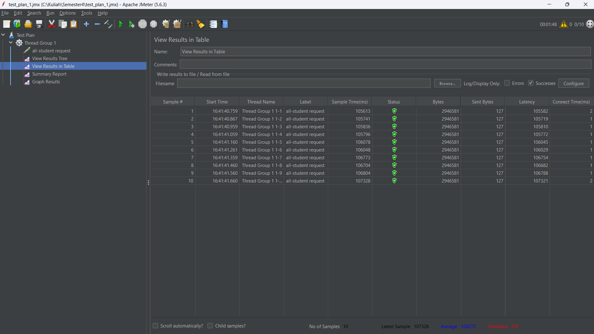
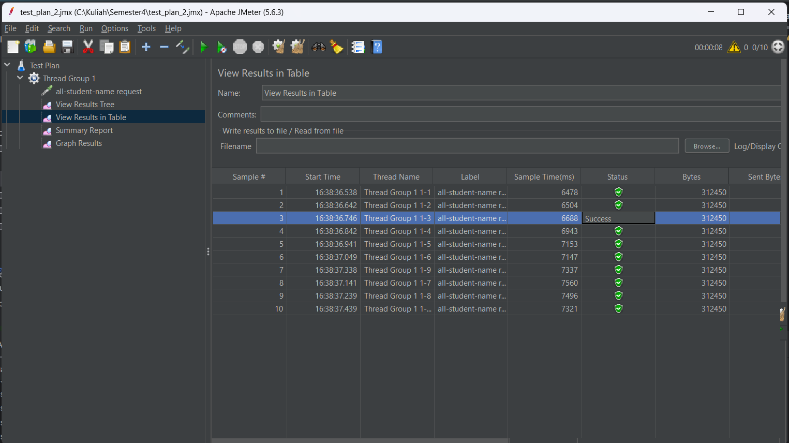
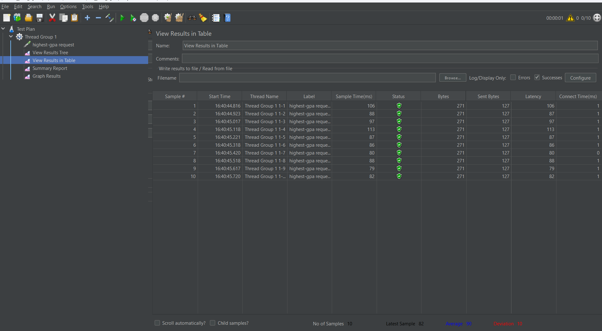
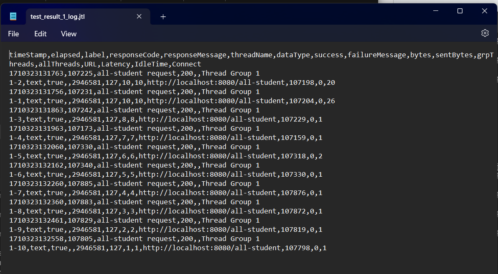
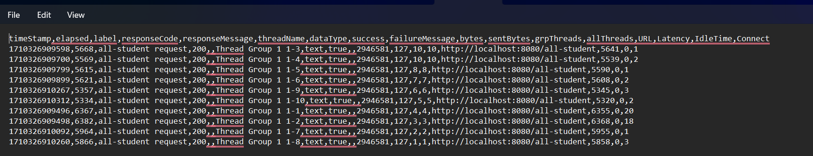
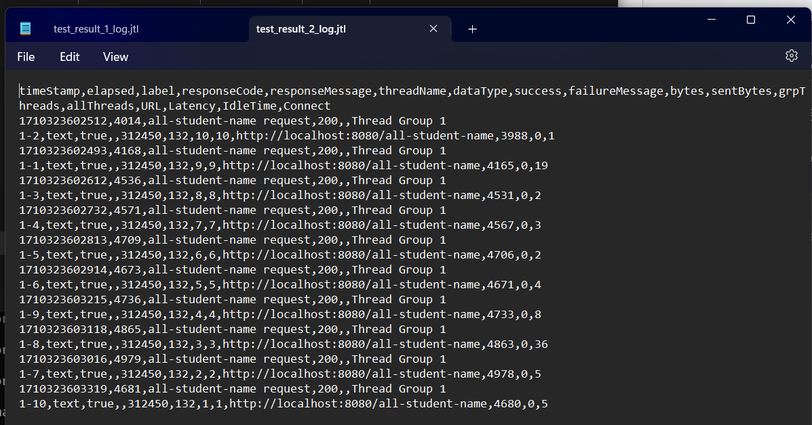
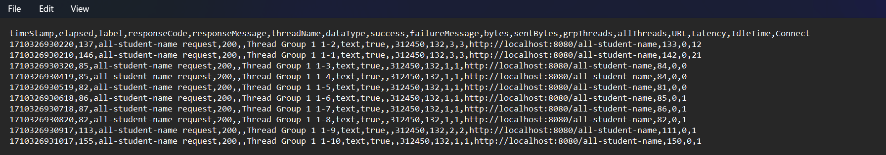
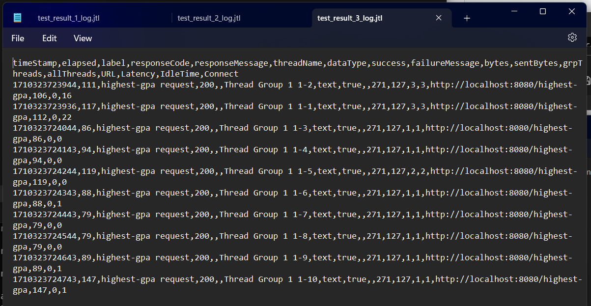
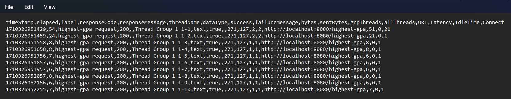

## Results

### JMeter GUI

- Testing all-student

- Testing all-student-name

- Testing highest-gpa

### JMeter Log (CLI)

- Testing all-student
  - Before opt: [test_result_1_log.jtl](documents/log/test_result_1_log.jtl)
  
  - After opt: [test_result_1_optimized_log.jtl](documents/log/test_result_1_optimized_log.jtl)
  
- Testing all-student-name
  - Before opt: [test_result_2_log.jtl](documents/log/test_result_2_log.jtl)
  
  - After opt: [test_result_2_optimized_log.jtl](documents/log/test_result_2_optimized_log.jtl)
    
- Testing highest-gpa
  - Before opt: [test_result_3_log.jtl](documents/log/test_result_3_log.jtl)
  
  - After opt: [test_result_3_optimized_log.jtl](documents/log/test_result_3_optimized_log.jtl)
  

We can see that, there is a huge difference between before and after optimizing with profiling the code like getAllStudentCourses, joinStudentName, and findStudentWithHighestGPA. From getAllStudentCourses' test results, there is 2x improvement on the elapsed time. Not only that, there is ~40x improvement on joinStudentName and ~2x improvement on findStudentWithHighestGpa.
## Reflection

> What is the difference between the approach of performance testing with JMeter and profiling with IntelliJ Profiler in the context of optimizing application performance?

The purpose of testing performance with JMeter is focused on evaluating the performance of the app under load. Like how it is in the real world case. In the other hand, the purpose of testing performance with IntelliJ Profiler is focused on analyzing the runtime behaviour of the app to identify bottlenecks and memory issues.

> How does the profiling process help you in identifying and understanding the weak points in your application?

Profiling helps us to find the bottlenecks and memory issues on our application. Hence, we can optimize those parts.

> Do you think IntelliJ Profiler is effective in assisting you to analyze and identify bottlenecks in your application code?

Yes, I can get to know which parts are the bottlenecks in this application. Then, I optimize those parts (getAllStudentCourses, joinStudentName, and findStudentWithHighestGPA).

> What are the main challenges you face when conducting performance testing and profiling, and how do you overcome these challenges?

Reading the report from profiling and testing is a pretty tough challange. The solution is we need to see every bit of details to identify our issues.

> What are the main benefits you gain from using IntelliJ Profiler for profiling your application code?

It is integrated with our IDE. So it is easier for us to debug, profiling, and modify our code in the same place.

> How do you handle situations where the results from profiling with IntelliJ Profiler are not entirely consistent with findings from performance testing using JMeter?

Although I have not gotten into these situtations. Here is my opinions. We can try to iterate and optimize each part based on the finding from both performance test and profiling. Also, make sure the test scenario and workloads used in the testing are representative of real-world use case. 

> What strategies do you implement in optimizing application code after analyzing results from performance testing and profiling? How do you ensure the changes you make do not affect the application's functionality?

Try hard to optimize the parts that took long time to run. If we found the issues, go fix and optimize it. After optimizing, we must make sure it does not affect our application's functionality. This is where the unit tests do their own job. 